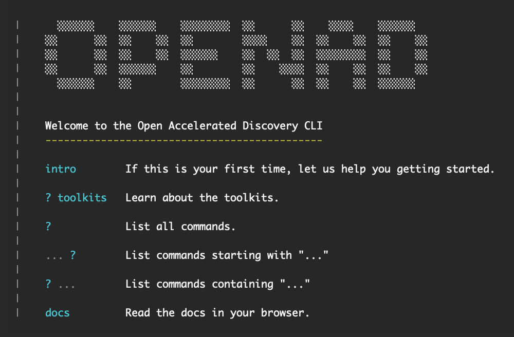

<!--

Table of contents
-----------------
- Install the "Markdown All in One" plugin in VSCode
- The TOC should be automatically updated. If it's not:
  • Open the command palette (Press Cmd+Shift+P (macOS) or Ctrl+Shift+P (Windows))
  • Type "Markdown All in One: Update Table of Contents"

Screenshots
-----------
For screenshots to look good, they should be small and ideally
all the same size. The script below lets you open the URLs in
the right size. Just paste this into the browser console and
press enter.

To take the screenshots with browser UI included on Mac, press
cmd+shift+4 followed by the spacebar, then click the window.
For consistency, stick to Chrome, hide your bookmarks & extensions.

    urls = [
        'https://cps.foc-deepsearch.zurich.ibm.com',
        'https://rxn.app.accelerate.science',
        'https://sds.app.accelerate.science',

    ]
    for (var i=0; i< urls.length; i++) {
        window.open(urls[i], '_blank', 'width=1000,height=600');
    }

-->

<!-- 

For testing
-----------
Un-comment this section to test how GitHub alerts are translated for Just the Docs.

> [!NOTE]
> Useful information that users should know,
> even when skimming content.

> [!TIP]
> Helpful advice for doing things
> better or more easily.

> [!IMPORTANT]
> Key information users need to know
> to achieve their goal.

> [!WARNING]
> Urgent info that needs immediate
> user attention to avoid problems.

> [!CAUTION]
> Advises about risks or negative
> outcomes of certain actions.

-->

# OpenAD

**Open-source framework for molecular and materials discovery**

<!-- description -->
Open Accelerated Discovery (aka OpenAD) is an open-source framework for molecular and materials discovery developed at IBM Research.

The OpenAD client is accessible from our command line interface, via Jupyter Notebook or our API. It provides unified access to a variety of tools and AI models for literature knowledge extraction, forward and retrosynthesis prediction, generative methods and property inference. OpenAD lets you train models on your own data, to then visualize and filter your candidate molecules.
<!-- /description -->

<!-- navigation -->
**[INSTALLATION]**
&nbsp;&nbsp;&nbsp;
**[GETTING STARTED]**
&nbsp;&nbsp;&nbsp;
**[COMMANDS]**
&nbsp;&nbsp;&nbsp;
**[MODELS SERVICE]**

**[PLUGINS]**
&nbsp;&nbsp;&nbsp;
**[AI ASSISTANT]**
&nbsp;&nbsp;&nbsp;
**[DEVELOPERS]**

<!-- /navigation -->

  

### Useful links

- **Homepage** 
  [accelerate.science/projects/openad](https://accelerate.science/projects/openad)
- **GitHub** 
  [github.com/acceleratedscience/open-ad-toolkit](https://github.com/acceleratedscience/open-ad-toolkit)
- **Pip install** 
  [pypi.org/project/openad](https://pypi.org/project/openad)
- **Documentation** 
  [acceleratedscience.github.io/openad-docs](https://acceleratedscience.github.io/openad-docs)

  

## Quick Install

> [!IMPORTANT]
> This will install OpenAD in your global space. If you wish to use a virtual environment (recommended), please refer to the [Installation](README_installation.md) page.

    pip install openad
    openad

Get started with Jupyter Notebook examples:

    init_magic
    init_examples
    jupyter lab ~/openad_notebooks/Table_of_Contents.ipynb

If you get an error when running `init_magic`, you may first need to setup the default iPython profile for magic commands.

    ipython profile create

  

## What's New

-   `%Openadd` has been added to the magic commands for commands that return data.
-   Upgraded SkyPilot to 0.6.0
-   Support for deploying in OpenShift AI/Open Data hub workbench or Podman/Docker image. [See the workbench repo](https://github.com/acceleratedscience/openad_workbench).
-   Support for application API
-   New property and dataset generation services. See [OpenAD Models Service](README_models-service.md)
    -   GT4SD Generation Services
    -   GT4SD Property Services
    -   GT4SD MoleR Generation
    -   GT4SD Molformer

    Pre-Requisite is that you have a AWS Account and can launch your own EC2 Instances Or someone else can launch them for you and you can catalog a Remote Service via URL.

  

## Feedback

- **Feature requests, feedback and questions:** 
  [phil.downey1@ibm.com](mailto:phil.downey1@ibm.com)
- **Bug reports:** 
  [Create issue on GitHub](https://github.com/acceleratedscience/open-ad-toolkit/issues)

  

## Learn

- [OpenAD blog](https://blog.accelerate.science/)
- **Demo Notebooks:** See `init_examples` under installation
<!-- [Mailing list]() -->

  

## Contribute
Stay tuned for detailed instructions on how to build your own OpenAD plugins. 
Check the [Developers] section for guidance with other contributions.

[INSTALLATION]: README_installation.md
[GETTING STARTED]: README_getting-started.md
[COMMANDS]: README_commands.md
[MODELS SERVICE]: README_models-service.md
[PLUGINS]: README_plugins.md
[AI ASSISTANT]: README_ai-assistant.md
[DEVELOPERS]: README_developers.md