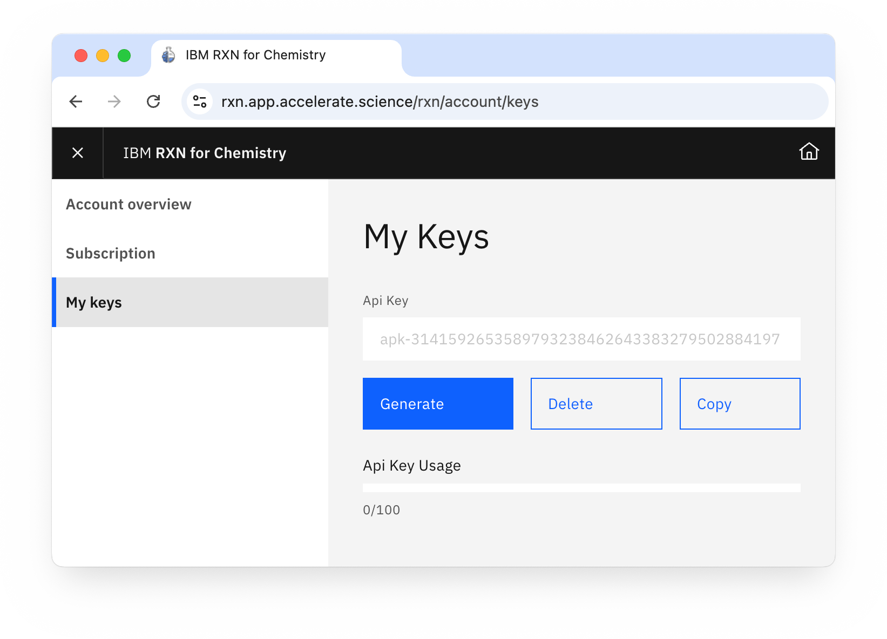

<!--

For screenshots to look good, they should be small and ideally
all the same size. The script below lets you open the URLs in
the right size. Just paste this into the browser console and
press enter.

To take the screenshots with browser UI included on Mac, press
cmd+shift+4 followed by the spacebar, then click the window.
For consistency, stick to Chrome.

- - -

urls = [
    'https://cps.foc-deepsearch.zurich.ibm.com',
    'https://rxn.app.accelerate.science',
    'https://sds.app.accelerate.science',

]
for (var i=0; i< urls.length; i++) {
    window.open(urls[i], '_blank', 'width=1000,height=600');
}

-->

# Open Accelerated Discovery <!-- omit from toc -->

[](https://pypi.org/project/openad/)
[](https://pypi.org/project/openad/)
[](https://opensource.org/licenses/MIT)
[](https://github.com/psf/black)
[](https://acceleratedscience.github.io/openad-docs/)

<br>

<!-- description -->

OpenAD is an open-source framework for molecular and materials discovery developed by IBM Research.

The OpenAD client is accessible from a command line interface, Jupyter Notebook and an API. It provides unified access to a variety of tools and AI models for literature knowledge extraction, forward and retrosynthesis prediction, generative methods and property inference. You can train models on your own data as well as visualize and filter candidate molecules.

<!-- /description -->

[Documentation](https://acceleratedscience.github.io/openad-docs/)

<br>

### See What's New <!-- omit from toc -->

<details>
<summary>See what's new in OpenAD</summary>
<div markdown="block">

-   `%Openadd` has been added to the magic commands for commands that return data.
-   New Macro Molecule viewer for visualising proteins
-   Upgraded SkyPilot to 0.6.0
-   Support for deploying in OpenShift AI/Open Data hub workbench or Podman/Docker image. [See the workbench repo](https://github.com/acceleratedscience/openad_workbench).
-   Support for application API
-   New property and dataset generation services.<br>We currently support the following model services:

    -   GT4SD Generation Services `git@github.com:acceleratedscience/generation_inference_service.git`
    -   GT4SD Property Services `git@github.com:acceleratedscience/property_inference_service.git`
    -   GT4SD MoleR Generation `git@github.com:acceleratedscience/moler_inference_service.git`
    -   GT4SD Molformer `git@github.com:acceleratedscience/molformer_inference_service.git`

    Pre-Requisite is that you have a AWS Account and can launch your own EC2 Instances Or someone else can launch them for you and you can catalog a Remote Service via URL.

    **Example:**

    -   Install a service

             catalog model service from 'git@github.com:acceleratedscience/property_inference_service.git' as prop

    -   Start the service

             model service up prop

    -   Wait until the service is ready

             model service status

    -   Once the service is ready, you can run the following commands to test:

        ```
        prop get molecule property [qed,esol] for [ C(C(C1C(=C(C(=O)O1)O)O)O)O ,[H-] ]
        ```

        ```
        prop get molecule property esol for C(C(C1C(=C(C(=O)O1)O)O)O)O
        ```

    -   Examples are supplied in the sample Notebooks.<br>See `init_examples` under the [Jupyter installation instructions](#setting-up-jupyter) below for more information.

    -   To shut down the service

            model service down prop

    -   Available commands for managing model services...

            model service status
            model service config <service_name>
            model catalog list
            uncatalog model service <service_name>
            catalog model service from (remote) '<path or github>' as <service_name>
            model service up <service_name> [no_gpu]
            model service local up <service_name>
            model service down <service_name>

</div>
</details>

<br>

### Before You Start <!-- omit from toc -->

<details>
<summary>Things you should know</summary>
<div markdown="block">

-   OpenAD is available for Linux and MacOS
-   We support Windows 11 via WSL 2 (ubuntu 22.04) - see [Installing on Windows](#installing-on-windows)
-   When not installing into a virtual environment on MacOS, you may need to use `python3` and `pip3` instead of `python` and `pip` respectively
-   When updating to 0.4.0 or above, first remove all toolkits by runnning `list toolkits` and then `remove toolkit <toolkit_name>`.

</div>
</details>

<br>

## Quick Install <!-- omit from toc -->

> **Note:** This will install OpenAD in your global space. If you wish to use a virtual environment, please see more [detailed instructions](#installation) below.

    pip install openad
    openad

Get started with Jupyter:

    init_magic
    init_examples
    jupyter lab ~/openad_notebooks/Table_of_Contents.ipynb

If you get an error when running `init_magic`, you may first need to setup the default iPython profile for magic commands.

    ipython profile create

<br>

---

<br>

## Table of Contents <!-- omit from toc -->

<!-- toc -->

-   [Installation](#installation)
-   [Getting Started - CLI](#getting-started---cli)
-   [Getting Started - Jupyter](#getting-started---jupyter)
    -   [Setting up Jupyter](#setting-up-jupyter)
    -   [Launching OpenAD in Jupyter](#launching-openad-in-jupyter)
-   [Interacting with the Toolkits](#interacting-with-the-toolkits)
    -   [Registration](#registration)
    -   [Adding a Toolkit](#adding-a-toolkit)
    -   [Sample Commands](#sample-commands)
    -   [Running Bash Commands (CLI)](#running-bash-commands-cli)
-   [AI Assistant](#ai-assistant)
    -   [IBM BAM Setup](#ibm-bam-setup)
    -   [Ollama Setup](#ollama-setup)
        -   [Ollama Remote Setup with SkyPilot](#ollama-remote-setup-with-skypilot)
        -   [Run Ollama](#run-ollama)
-   [Model Services](#model-services)
-   [For Developers](#for-developers)
    -   [Installation for Development](#installation-for-development)
    -   [Testing a branch](#testing-a-branch)
-   [Installing on Windows](#installing-on-windows)
    -   [Before You Start](#before-you-start)
    -   [Installing WSL](#installing-wsl)
-   [Linux Notes](#linux-notes)

<!-- tocstop -->

<br>

---

<br>

<a name="installation"></a>

# Installation

> **Note:** Contributors should skip to [Installation for Development](#installation-for-development)

> **Note:** Linux users may want to check the [Linux Notes](#linux-notes)

> **Note:** If you prefer using poetry and you know what you're doing, you can skip the instructions below and run `poetry add openad` instead.

1.  **Step 0: Before you start**<br>
    Ensure you're running Python 3.10 or 3.11. There's multiple ways of updating Python, we'll use pyenv.

    > **Note:** Due to an issue with one of our dependencies, Python 3.12 is not yet supported.

        git clone https://github.com/pyenv/pyenv.git ~/.pyenv
        pyenv install 3.11

1.  **Step 1: Set up your virtual environment** (optional)<br>

        python3.11 -m venv ~/ad-venv
        source ~/ad-venv/bin/activate

    > **Note:** To exit the virtual environment, you can run `deactivate`

1.  **Step 2: Installation**

        pip install openad

<br>

# Getting Started - CLI

-   **Enter the virtual environment**

    > **Note:** If you just installed OpenAD, you probably already activated the virtual environment.

        source ~/ad-venv/bin/activate

-   **Enter the command shell**

        openad

    <!--  -->
    <!-- <a href="https://raw.githubusercontent.com/acceleratedscience/open-ad-toolkit/main/assets/screenshot-landing.png" target="_blank"></a> -->

-   **Exit the command shell**<br>
    Hit `ctrl+c` or run:

        exit

-   **Run a single command from outside the command shell**

        openad <command>

-   **Exit the virtual environment**<br>

        deactivate

<br>

# Getting Started - Jupyter

## Setting up Jupyter

The following commands only need to be run once after installation:

1.  **Activate your virtual environment**

    > **Note:** If you just installed OpenAD, you probably already activated the virtual environment.

        source ~/ad-venv/bin/activate

1.  **Create an iPython kernel**<br>
    This ports your virtual environment to Jupyter.

        python -m ipykernel install --user --name=ad-venv

    > **Note:** To list your installed iPython kernels, you can run `jupyter kernelspec list`, and to remove the kernel you can run `jupyter kernelspec uninstall ad-venv`

1.  **Install the magic commands**<br>
    This enables OpenAD commands to be run within a Jupyter Notebook.

        init_magic

    <details>
    <summary><b>Alternative:</b> Manually add magic commands</summary>
    <div markdown="block">

    If you don't want to activate magic commands in all Notebooks, you can instead activate them for individual Notebooks.

    -   Run `init_examples`
    -   Copy the file `~/openad_notebooks/openad.ipynb` to the same directory as the Notebook you wish to activate.
    -   In your Notebook, run this inside a code cell: `!run openad.ipynb`

    </div>
    </details>

1.  **Install example Notebooks**<br>
    This installs our example Notebooks at `~/openad_notebooks`.

        init_examples

<br>

## Launching OpenAD in Jupyter

1.  **Open any Notebook**<br>
    The following command will open up the example Notebook:

        jupyter lab ~/openad_notebooks/Table_of_Contents.ipynb

1.  **Select the kernel**<br>
    Make sure to select the "ad-venv" iPython kernel. You can do this under _Kernel > Change Kernel_, or in the latest versions of Jupyter by clicking the kernel name in the top right hand corner. If you don't see your iPython kernel, make sure you followed the Jupyter Setup instructions listed above.

    <figure>
        <a href="https://raw.githubusercontent.com/acceleratedscience/open-ad-toolkit/main/assets/jupyter-notebook-kernel.png" target="_blank"></a>
    </figure>
    <figure>
        <a href="https://raw.githubusercontent.com/acceleratedscience/open-ad-toolkit/main/assets/jupyter-lab-kernel.png" target="_blank"></a>
    </figure>

1.  **Magic Commands**<br>
    Magic commands let you run terminal commands from within Jupyter. They are invoked by the `%openad` prefix. All OpenAD CLI commands can be accessed like this. For example:<br>

        %openad list files

<br>

# Interacting with the Toolkits

OpenAD integrates with `DS4SD`, `RXN`, and has placeholder support for `ST4SD`.

> [!IMPORTANT]
> When running commands from Jupyter, prepend them with `%openad`

### Registration

Before you can interact with the toolkits, you'll need to register with each individual toolkit.

<details>
<summary>Register with DS4SD (Deep Search)</summary>
<div markdown="block">

1. First, you'll need to generate an API key on the Deep Search website.

    - Visit the Deep Search website and create an account:<br>
      [deepsearch-experience.res.ibm.com](https://deepsearch-experience.res.ibm.com)<br>
    - Once logged in, click the Toolkit/API icon in the top right hand corner, then open the HTTP section
    - Click the "Generate new API key" button<br>
      <br>
          <!--  -->
        <a href="https://raw.githubusercontent.com/acceleratedscience/open-ad-toolkit/main/assets/ds4sd-api-key.png" target="_blank"></a>

1. Once inside the OpenAD client, you'll be prompted to authenticate when activating the Deep Search (DS4SD) toolkit. When running `set context ds4sd` :

    - **Hostname:** [https://sds.app.accelerate.science](https://sds.app.accelerate.science)
    - **Email:** Your email
    - **API_key:** The DS4SD API key you obtained following the instructions above.

1. You should get a message saying you successfully logged in.

    > **Note:** Your DS4SD auth config file is saved as `~/.openad/deepsearch_api.cred`. If you ever want to reset your DS4SD login information you can run `set context ds4sd reset`, or you can delete this file.<br>

</div>
</details>

<details>
<summary>Register with RXN</summary>
<div markdown="block">

1. First, you'll need to generate an API key on the RXN website.

    - Sign up for an RXN account at [rxn.app.accelerate.science](https://rxn.app.accelerate.science)
    - Obtain your API key by clicking the user profile icon in the top right hand corner and select "My profile".<br>
      <br>
          <!--  -->
        <a href="https://raw.githubusercontent.com/acceleratedscience/open-ad-toolkit/main/assets/rxn-api-key.png" target="_blank"></a>

1. When setting the context to RXN using `set context rxn` you'll be prompted to create a new auth configuration file:

    - **Hostname:** [https://rxn.app.accelerate.science](https://rxn.app.accelerate.science)<br>
    - **API_key:** The RXN API key you obtained following the instructions above.

1. You should get a message saying you successfully logged in.<br>

    > **Note:** Your RXN auth config file is saved as `~/.openad/rxn_api.cred`. If you ever want to reset your RXN login information you can run `set context rxn reset`, or you can delete this file.<br>

</div>
</details>

### Adding a Toolkit

First install the toolkit, then set the context to this toolkit.

    add toolkit ds4sd
    set context ds4sd

### Sample Commands

    # DS4SD
    display all collections

    # RXN
    list rxn models

### Running Bash Commands (CLI)

To run a command in bash mode, prepend it with `openad` and make sure to escape quotes.

    openad show molecules using file \'base_molecules.sdf\'

<br>

# AI Assistant

To enable our AI assistant, you'll either need access to [IBM BAM](https://bam.res.ibm.com/auth/signin) or use the free open source LLM [Ollama](https://ollama.com).

> **Note:** Ollama requires an 8GB GPU

> **Note:** Support for WatsonX is coming soon

<br>

## IBM BAM Setup

To use IBM BAM if you have access to it, simply provide your API key when prompted.

    set llm bam
    tell me <enter prompt>

<br>

## Ollama Setup

1.  Install [Ollama](https://ollama.com/download) onto your platform.

1.  Download the appropriate models.

        ollama pull llama3:latest
        ollama pull nomic-embed-text

1.  Start the server if not already started.

        ollama serve

That's it for local usage. If you want to run Ollama remotely, continue below.

### Ollama Remote Setup with SkyPilot

1.  Check out our configuration file to launch ollama on SkyPilot: [ollama_setup.yaml](./openad/ollama_setup.yaml)

        sky serve up ollama_setup.yaml

1.  Set up local environment variables

    -   For windows `setx OLLAMA_HOST=<sky-server-ip>:11434`
    -   For Linux and macOS `export OLLAMA_HOST=<sky-server-ip>:11434`
    -   To reset to local use `OLLAMA_HOST=0.0.0.0:11434`

### Run Ollama

> **Note:** If prompted for an API key and none was setup, just leave the input empty.

    set llm ollama
    tell me <enter prompt>

<br>

# Model Services

To use the model services you'll need to have the AWS CLI installed to check if SkyPilot is enabled to deploy to AWS from your machine:

    sky check

Launching any model service will take about 10 minutes to deploy. This can be monitored using the controller logs, e.g.:

    sky serve logs sky-service-0af4 --controller

<br>

# For Developers

OpenAD is fully open source and we encourage contributions. We plan to provide documentation on how to integrate your own toolkits in the future.

If you have any questions in the meantime, please [reach out]().

<br>

## Installation for Development

<details>
<summary>Install using the setup wizard (uses poetry)</summary>
<div markdown="block">

1.  **Step 1: Download the repo**

        git clone https://github.com/acceleratedscience/open-ad-toolkit.git

    > **Note:** To download a specific branch, you can run instead:<br> > `git clone -b <branch_name> https://github.com/acceleratedscience/open-ad-toolkit.git`

1.  **Step 2: Launch the setup wizard**

        cd open-ad-toolkit
        ./setup.sh

</div>
</details>

<details>
<summary>Install using pip</summary>
<div markdown="block">

1.  **Step 0: Before you start**<br>
    Ensure you're running Python 3.10.10 or above. There's multiple ways of doing this, we'll use pyenv.

            git clone https://github.com/pyenv/pyenv.git ~/.pyenv
            pyenv install 3.10

1.  **Step 1: Set up your virtual environment** (optional)<br>

        python -m venv ~/ad-venv
        source ~/ad-venv/bin/activate

    > **Note:** To exit the virtual environment, you can run `deactivate`

1.  **Step 2: Download the repo**

        git clone https://github.com/acceleratedscience/open-ad-toolkit.git

    > **Note:** To download a specific branch, you can run instead:<br> > `git clone -b <branch_name> https://github.com/acceleratedscience/open-ad-toolkit.git`

1.  **Step 2: Install the requirements**

        cd open-ad-toolkit
        pip install -e .

    > **Note:** The -e flag stands for "editable". This means that instead of copying the package's files to the Python site-packages directory as in a regular installation, pip creates a symbolic link (symlink) from your package's source code directory into your Python environment.<br>This way you can make changes to the source code of the package, and those changes are immediately reflected in your Python environment. You don't need to reinstall the package every time you make a change.

</div>
</details>

<br>

## Testing a branch

To do a regular install from a particular branch, you can run:

    pip install git+https://github.com/acceleratedscience/open-ad-toolkit.git@<branch_name>

<br>

# Installing on Windows

In order to run OpenAD on Windows 11, you will need to install the Ubuntu WSL package ("Windows Subsystem for Linux").

<br>

## Before You Start

-   **Verify Windows version**<br>
    To check if you are running Windows 11 or later, press `Win` + `R`, type "winver", and press `Enter`. A window will open showing your Windows version.

-   **Verify WSL**<br>
    To check if you already have WSL installed, run `wsl -l -v` into the terminal. To see more information about your current version of Ubuntu, run `lsb_release -a`

<br>

## Installing WSL

Install WSL and create a user called 'openad' or one of your choosing.

    wsl --install Ubuntu-22.04

**Optional:** To setup an Ubuntu Python environment from scratch, continue to <a href="#linux-notes">Linux Notes</a>

<br>

# Linux Notes

If you wish to setup an Ubuntu Python environment from scratch, run:

    sudo add-apt-repository ppa:deadsnakes/ppa
    sudo apt update
    sudo apt install python3.11-full
    sudo apt install python3-pip
    sudo update-alternatives --install /usr/bin/python3 python3 /usr/bin/python3.11 100
    sudo pip install pip --upgrade

You will need to restart your Linux session before running `pip install openad` so that the python libraries are in your path.

If you get an error when running `init_magic`, you may first need to setup the default iPython profile for magic commands.

    ipython profile create
