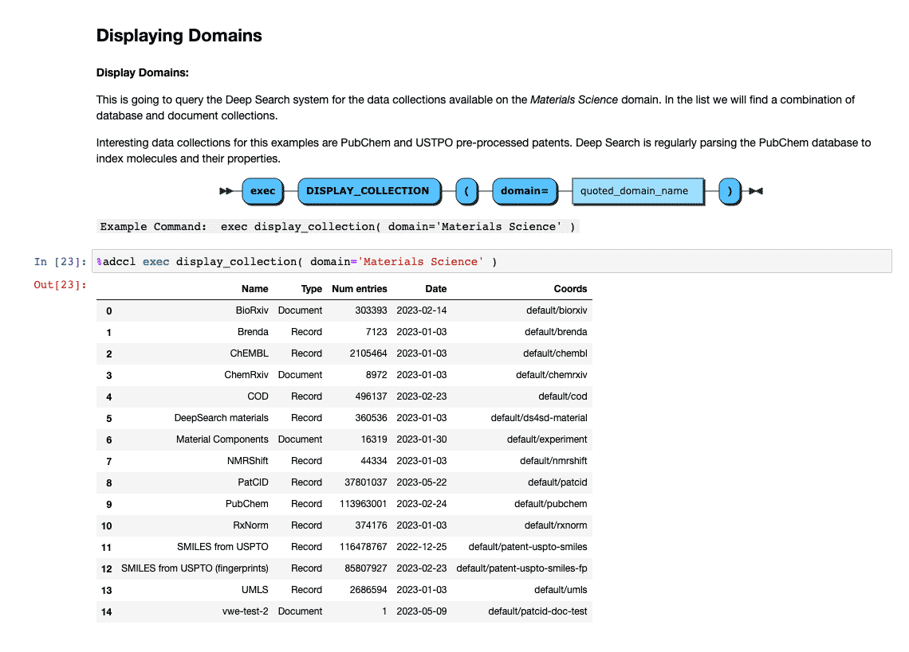

# ADCCL

Accelerated Discovery Common Client 

_Note: if you're on Mac, please use `pip3` and `python3` instead of `pip` and `python` respectively._

 

## Preparation

1.  **Before You Start** 
    Ensure you're running Python 3.10.10 or above.

1.  **Step 1: Set up Virtual Environment** (optional) 

        python -m venv  ./myenv
        source ./myenv/bin/activate

1.  **Step 2: Installation** 
    Download [the repository](https://github.ibm.com/Phil-Downey1/adccl) or clone it using ssh:

         git clone git@github.ibm.com:Phil-Downey1/adccl.git

    Install the requirements:

        pip install -r requirements.txt

    If you plan to use it inside Jupyter Notebook of Jupyter Labs: 
        `pip install -r jupyter_requirements.txt`  
    install ipykernel, which consists of IPython as well  
        `pip install ipykernel`  
    create a kernel that can be used to run notebook commands inside the virtual environment  
        `python -m ipykernel install --user --name=my-env`

 

## Getting Started

-   **Enter the Shell Environment**

        # Enable permissions (only once)
        chmod 777 adccl

        # Launch
        ./adccl

    Alternatively for jupyter lab, you can:

        # Enable permissions (only once)
        chmod 777 adccl-jupyter

        # Launch
        .
        ./adccl-jupyter

     
      
    

-   **Exit** 
    Hit `ctrl+c` or type:

        exit

-   **Installing Toolkits** 
    You can install the `DS4SD`, `GT4SD`, `ST4SD` and `RXN` toolkits, however please note that at this time, they are meant as placeholders and only `DS4SD` supports experimental functionality.

        add toolkit ds4sd

-   **Running as a Bash Command** 
    To run any commands as a bash command, make sure to prepend any quotes with `\`.

        ./adccl show molecules using file \'base_molecules.sdf\'

-   **Working with Notebooks**

    -   From the installation directory, start Jupyter Lab or jupyter Notebooks:

            jupyter lab
            jupyter notebook

    -   Magic commands are implemented by the adccl.ipynb file and are invoked by the `%adccl` prefix. For example:

            %adccl list files

    -   Open the table of contents to get an introduction and be taken through step by step how to use the tool.
        

    -   Play with Deep Search using the magic comands
        

    -   You can also copy commands from a terminal version and work in your own terminal or the Jupyter Lab built-in Terminal
