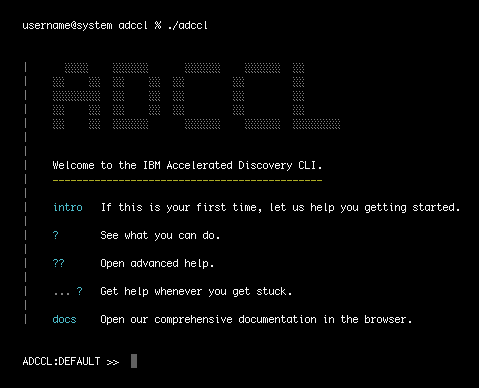
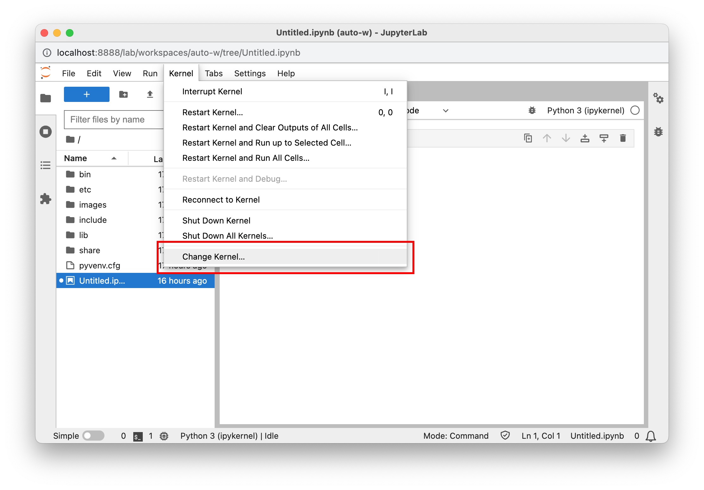
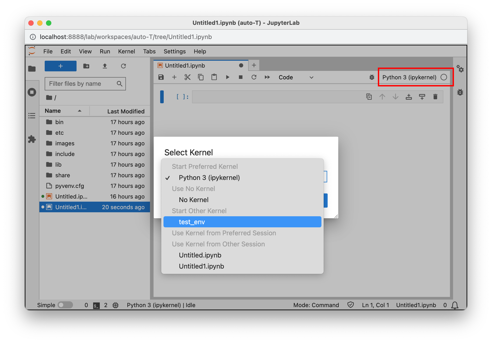
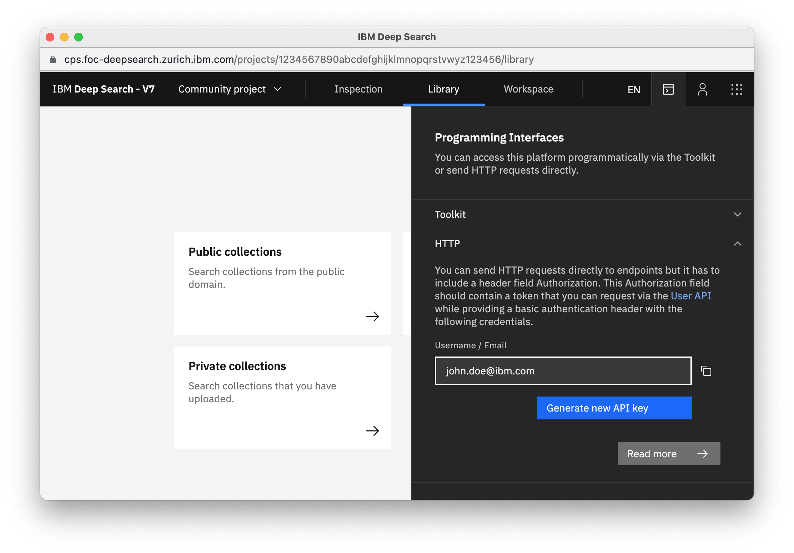
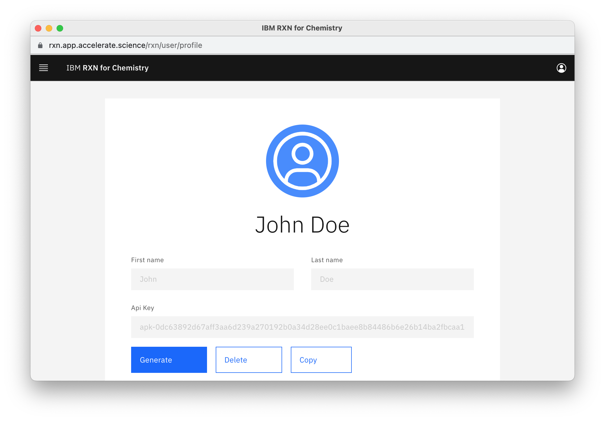

# OpenAD

**Open Accelerated Discovery Client** 
[Project homepage](https://pages.github.ibm.com/Accelerated-Discovery/ad4e-opentoolkit/)

---

 

## Notes

-   Only available for Linux and MacOS
-   Currently only the OpenAI API is available for the _Tell Me_ Function (WatsonX coming soon)
-   If you're on Mac and not installing into a virtual environment, you may need use `pip3` and `python3` instead of `pip` and `python` respectively. 

 

## Installation

> **Note:** If you're installing a development version of OpenAD, please jump to [Installation for Development](#installation-for-development)

1.  **Step 0: Before you start** 
    Ensure you're running Python 3.10.10 or above.

1.  **Step 1: Set up virtual environment** (optional) 

        python -m venv ~/ad-venv
        source ~/ad-venv/bin/activate

    > **Note:** To exit the virtual environment, you can run `deactivate`

1.  **Step 2: Installation** 

        pip install git+ssh://git@github.ibm.com/Accelerated-Discovery/ad4e-opentoolkit.git

    > _**Note:** Before pip installing from git, ensure you have ssh set up for git install, otherwise you can download the repository and run `pip install .` from the top directory (ad4e-opentoolkit)._

1.  **Launch** 
    To enter the command shell, simply enter `openad` from the command line.

    > _**Note:** To see available commands, run `?`_

 

## Getting Started - CLI

-   **Entering the Shell Environment** 
    Run from any directory:

        openad

    

-   **Exiting the Shell Environment** 
    Hit `ctrl+c` or run:

        exit

-   **Installing Toolkits** 
    You can install the `DS4SD`, `GT4SD`, `ST4SD` and `RXN` toolkits, however please note that at this time, only `DS4SD` and `RXN` support experimental functionality while the others are meant as placeholders.

        add toolkit ds4sd
        add toolkit rxn

-   **Running Bash Commands** 
    To run any command in bash mode, prepend it with `openad` and make sure to prepend any quotes with `\`.

        openad show molecules using file \'base_molecules.sdf\'

 

## Getting Started - Jupyter

### Jupyter Setup

If you plan to use this application inside Jupyter Notebook of JupyterLab, you should set it up as follows:

1.  **Activate your virtual environment** 
    This should already be active, per [Installation](#installation) instructions on top.

        source ~/ad-venv/bin/activate

2.  **Create an iPython kernel** 
    This is used to run Notebook commands inside the virtual environment:

        python -m ipykernel install --user --name=ad-kernel

    > **Note:** To list your installed iPython kernels, you can run `jupyter kernelspec list` 
    > To remove the kernel you can run `jupyter kernelspec uninstall ad-kernel`

3.  **Initiate the magic commands.** 
    This copies the magic commands into the iPython startup directory for your created profile:

        init_magic

    > **Note:** You can also: 
    > • Initiate in a single notebook only: `init_magic .` followed by `run openad.py` 
    > • Initiate within another iPython profile: `init_magic <profile_name>` 
    > • Initiate without installing anything: `run openad.ipynb` after installing examples (see next bullet) 
    > --> This executes the file `~/openad_notebooks/openad.ipynb` and needs to be run every time after restarting the kernel

4.  **Install the Notebook examples** 
    This creates the `~/openad_notebooks` folder with a number of demonstration notbeooks. 
    Start with `Table_of_Contents.ipynb`.

         init_examples

 

### Jupyter Launch

-   After installing the Notebook examples, open the table of contents to get an introduction and be taken through step by step how to use the tool.

        jupyter lab ~/openad_notebooks/Table_of_Contents.ipynb

    > **NOTE:** By launching Jupyter this way it will automatically launch the trial notebooks.

-   Make sure to select your newly created "ad-kernel" iPython kernel. You can do this under _Kernel > Change Kernel_, or in the latest versions of Jupyter by clicking the kernel name in the top right hand corner. If you don't see your iPython kernel, make sure you followed the Jupyter Setup instructions listed above.

 
<figure>
    <figcaption align="center" style="font-size:0.9em;opacity:.6;margin-bottom:-15px"><i>Jupyter Notebook</i></figcaption>
    
</figure>

<figure>
    <figcaption align="center" style="font-size:0.9em;opacity:.6;margin-bottom:-15px"><i>Jupyter Lab</i></figcaption>
    
</figure>

-   Magic commands are implemented by the _openad.py_ or _openad.ipynb_ files, and are invoked by the `%openad` prefix. For example: 

        %openad list files

-   An example magic comands to play with Deep Search: 

        %openad exec display_collection(domain='Material Science')

-   An example magic commands to play with RXN

        %openad list rxn models

 

## Getting Access to RXN, DeepSearch and Tell Me Functionality

Below you find login instructions for RXN and DeepSearch. If you choose to use the `Tell Me` function, you will also need to obtain a OpenAI API account. 

 

### DeepSearch

1. First, you'll need to generate an API key on the DeepSearch website.

    - **IBM Users:** Activate the Cisco Secure Client VPN to access the IBM-internal edge version of DeepSearch: [cps.foc-deepsearch.zurich.ibm.com](https://cps.foc-deepsearch.zurich.ibm.com)
    - **Non-IBM Users:** Access the public version of DeepSearch: [deepsearch-experience.res.ibm.com](https://deepsearch-experience.res.ibm.com)
    - Once logged in, click the Toolkit/API icon, then open the HTTP section
    - Click the "Generate new API key" button 
       
      

1. When setting the context to DeepSearch using `set context ds4sd` you'll be prompted to create a new auth configuration file:

    - **Hostname:** [https://cps.foc-deepsearch.zurich.ibm.com](https://cps.foc-deepsearch.zurich.ibm.com) 
    - **Email:** Your IBM email 
    - **API_key:** The DS4SD API key you obtained following the instructions above.

1. You should get a message saying you successfully logged in.

    > **Note:** Your DS4SD auth config file is saved as `~/.openad/ds-auth.ext-v2.json`. If you ever want to reset your DS4SD login information, simply delete this file. 

 

### RXN

1. First, you'll need to generate an API key on the RXN website.

    - Sign up for an RXN account at [rxn.app.accelerate.science](https://rxn.app.accelerate.science)
    - Obtain your API key by clicking the user profile icon in the top right hand corner and select "My profile". 
       
      

1. When setting the context to RXN using `set context rxn` you'll be prompted to create a new auth configuration file:

    - **Hostname:** [https://rxn.app.accelerate.science](https://rxn.app.accelerate.science) 
    - **API_key:** The RXN API key you obtained following the instructions above.

1. You should get a message saying you successfully logged in.

    > **Note:** Your RXN auth config file is saved as `~/.openad/rxn-auth.ext-v2.json`. If you ever want to reset your RXN login information, simply delete this file. You can also do this by running `set context ds4sd reset` 

 

### OpenAI

In order to use the "Tell me" functionality, you will need to create an account with OpenAI. There is a one month free trial.

> **Note:** WatsonX coming soon

1. Go to [platform.openai.com](https://platform.openai.com) and create an account

1. Click on the profile icon in the top right and choose "View API keys"

1. Create a new key

1. Run `tell me` to be prompted for your OpenAI API credentials

1. Your hostname is [https://api.openai.com/v1/models](https://api.openai.com/v1/models)

## Installation for Development

Only follow these instructions if you're contributing to the codebase.

1.  **Step 0: Before you start** 
    Ensure you're running Python 3.10.10 or above.

1.  **Step 1: Set up virtual environment** (optional) 

        python -m venv ~/ad-venv
        source ~/ad-venv/bin/activate

    > **Note:** To exit the virtual environment, you can run `deactivate`

1.  **Step 2: Installation** 
    [Download](https://github.ibm.com/Accelerated-Discovery/ad4e-opentoolkit) or clone the right branch from GitHub:

         git clone -b <branch_name> git@github.ibm.com:Accelerated-Discovery/ad4e-opentoolkit.git

    Then, enter the repo's top directory and install the requirements

         cd ad4e-opentoolkit
         pip install -e .

    > **Note:** The `-e` flag stands for "editable". This means that instead of copying the package's files to the Python site-packages directory as in a regular installation, pip creates a symbolic link (symlink) from your package's source code directory into your Python environment.
    > This way you can make changes to the source code of the package, and those changes are immediately reflected in your Python environment. You don't need to reinstall the package every time you make a change.

**Testing a branch** 
To do a regular install from a particular branch, you can run:
pip install git+ssh://git@github.ibm.com/Accelerated-Discovery/ad4e-opentoolkit.git@<branch_name>

<!--

For screenshots to look good, they should be small and ideally
all the same size. The script below lets you open the URLs in
the right size. Just paste this into the browser console and
press enter.

To take the screenshots with browser UI included on Mac, press
cmd+shift+4 followed by the spacebar, then click the window.
For consistency, stick to Chrome.

- - -

urls = [
    'https://cps.foc-deepsearch.zurich.ibm.com',
    'https://rxn.app.accelerate.science',
    'https://sds.app.accelerate.science',
    'https://platform.openai.com/account/api-keys'
]
for (var i=0; i< urls.length; i++) {
    window.open(urls[i], '_blank', 'width=1000,height=600');
}

-->
