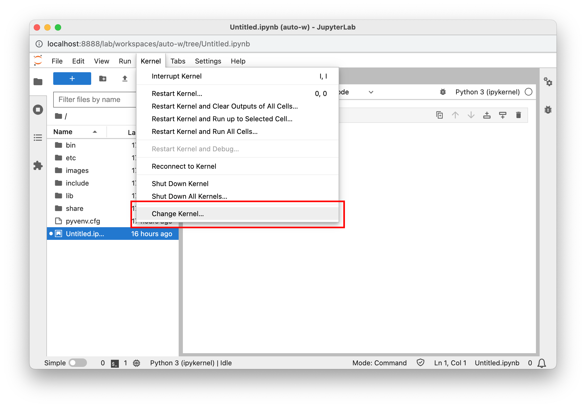

[&larr; BACK](../#openad)

# Getting Started with OpenAD

---

- If you haven't yet done so, [install OpenAD](installation.md) first.
- When installing on macOS without a virtual environment, you may need to use `python3` and `pip3` instead of `python` and `pip`.
- When updating to OpenAD `0.4.0` or above, first remove all toolkits by runnning `list toolkits` and then `remove toolkit <toolkit_name>`.

---

 

# Getting Started - CLI

-   **Enter the virtual environment**

    > **Note:** If you just installed OpenAD, you probably already activated the virtual environment.

        source ~/ad-venv/bin/activate

-   **Enter the command shell**

        openad

-   **Exit the command shell** 
    Hit `ctrl+c` or run:

        exit

-   **Run a single command from outside the command shell**

        openad <command>

-   **Exit the virtual environment** 

        deactivate

## Running Bash Commands

To run a command in bash mode, prepend it with `openad` and make sure to escape quotes.

    openad show molecules using file \'base_molecules.sdf\'

 

# Getting Started - Jupyter

## Setting up Jupyter

The following commands only need to be run once after installation:

1.  **Activate your virtual environment**

    > **Note:** If you just installed OpenAD, you probably already activated the virtual environment.

        source ~/ad-venv/bin/activate

1.  **Create an iPython kernel** 
    This ports your virtual environment to Jupyter.

        python -m ipykernel install --user --name=ad-venv

    > **Note:** To list your installed iPython kernels, you can run `jupyter kernelspec list`, and to remove the kernel you can run `jupyter kernelspec uninstall ad-venv`

1.  **Install the magic commands** 
    This enables OpenAD commands to be run within a Jupyter Notebook.

        init_magic

    

    
<b>Alternative:</b> Manually add magic commands

    

    If you don't want to activate magic commands in all Notebooks, you can instead activate them for individual Notebooks.

    -   Run `init_examples`
    -   Copy the file `~/openad_notebooks/openad.ipynb` to the same directory as the Notebook you wish to activate.
    -   In your Notebook, run this inside a code cell: `!run openad.ipynb`

    

    

1.  **Install example Notebooks** 
    This installs our example Notebooks at `~/openad_notebooks`.

        init_examples

 

## Launching OpenAD in Jupyter

1.  **Open any Notebook** 
    The following command will open up the example Notebook:

        jupyter lab ~/openad_notebooks/Table_of_Contents.ipynb

1.  **Select the kernel** 
    Make sure to select the "ad-venv" iPython kernel. You can do this under _Kernel > Change Kernel_, or in the latest versions of Jupyter by clicking the kernel name in the top right hand corner. If you don't see your iPython kernel, make sure you followed the Jupyter Setup instructions listed above.

    
    
    

2.  **Magic Commands** 
    Magic commands let you access any OpenAD CLI command from within Jupyter. They are invoked by the `%openad` prefix.

        %openad list files

    If you wish to retrieve data from an OpenAD command, you can use the `%openadd` prefix instead. This will return raw, unstyled data for further processing.

        my_data = %openadd display data 'my_data_file.csv'