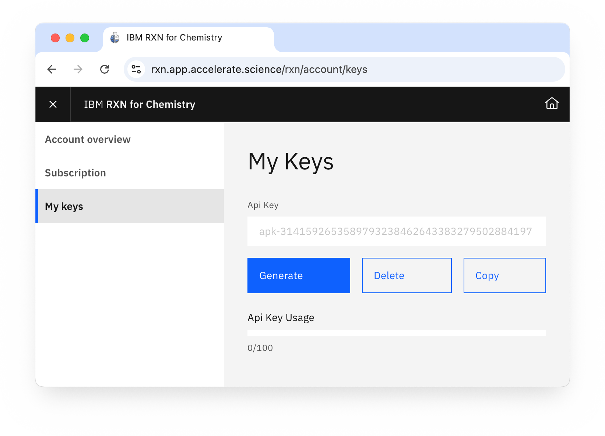

[&larr; BACK](../#openad)

# OpenAD Plugins

<!-- about_plugin -->
Plugins are how molecular tools and AI models are made available to the OpenAD client. They provide drastically simplified access to a series of advanced tools, and they make it easy for your own Python applications to interface with OpenAD.

Creating your own plugins is easy if you have a basic understanding of Python.
<!-- /about_plugin -->

  

## Registration

Before you can interact with the plugins, you'll need to register with each individual plugin.

Register with DS4SD (Deep Search)

1. First, you'll need to generate an API key on the Deep Search website.

    - Visit the Deep Search website and create an account: 
      [deepsearch-experience.res.ibm.com](https://deepsearch-experience.res.ibm.com) 
    - Once logged in, click the `Toolkit / API` icon in the top right hand corner, then open the HTTP section
    - Click the "Generate new API key" button 
       
      
      <!--  -->

2. Once inside the OpenAD client, you'll be prompted to authenticate when activating the Deep Search (DS4SD) toolkit. When running `set context ds4sd` :

    - **Hostname:** Default: [https://sds.app.accelerate.science](https://sds.app.accelerate.science)
    - **Email:** Your email
    - **API_key:** The DS4SD API key you obtained following the instructions above.

3. You should get a message saying you successfully logged in.

    > **Note:** Your DS4SD auth config file is saved as `~/.openad/deepsearch_api.cred`. If you ever want to reset your DS4SD login information you can run `set context ds4sd reset`, or you can delete this file. 

Register with RXN

1. First, you'll need to generate an API key on the RXN website.

    - Sign up for an RXN account at [rxn.app.accelerate.science](https://rxn.app.accelerate.science)
    - Obtain your API key by clicking the user profile icon in the top right hand corner and select "Account", then select the "My keys" tab. 
       
      
      <!--  -->

2. When setting the context to RXN using `set context rxn` you'll be prompted to create a new auth configuration file:

    - **Hostname:** Default: [https://rxn.app.accelerate.science](https://rxn.app.accelerate.science) 
    - **API_key:** The RXN API key you obtained following the instructions above.

3. You should get a message saying you successfully logged in. 

    > **Note:** Your RXN auth config file is saved as `~/.openad/rxn_api.cred`. If you ever want to reset your RXN login information you can run `set context rxn reset`, or you can delete this file. 

  

## Adding a Toolkit

First install the toolkit, then set the context to this toolkit.

> [!IMPORTANT]
> When running commands from Jupyter, prepend them with `%openad`

    add toolkit ds4sd
    set context ds4sd

    add toolkit rxn
    set context rxn

  

## Sample Commands

    # DS4SD
    display all collections

    # RXN
    list rxn models

  

## Running Bash Commands (CLI)

To run a command in bash mode, prepend it with `openad` and make sure to escape quotes.

    openad show molecules using file \'base_molecules.sdf\'