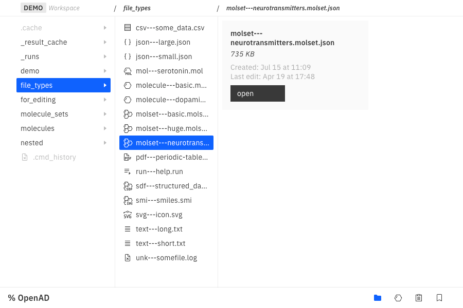
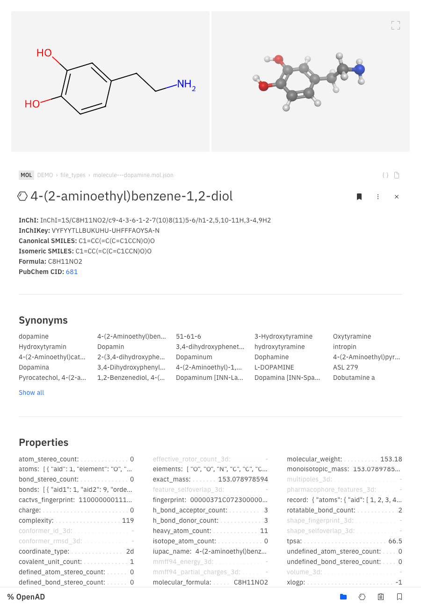
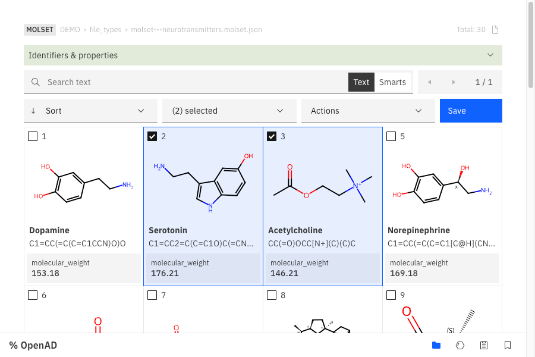
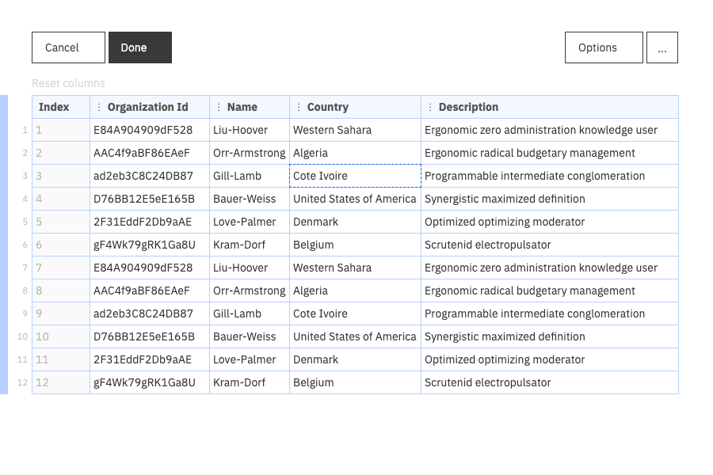
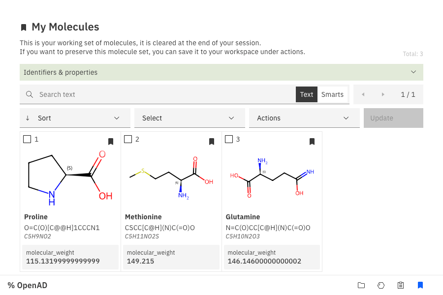
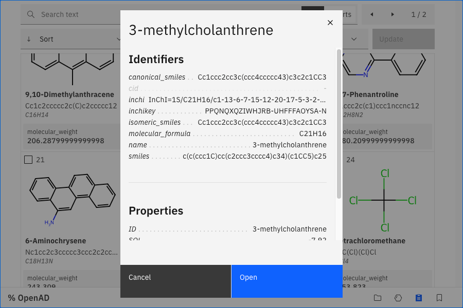

<!-- When doing changes to this file, please keep them in sync with the _gui-demo.ipynb Notebook file. -->

# OpenAD GUI

The OpenAD GUI provides a visual window onto your data, helping you with evaluation and triage.

The code base for the GUI lives in a separate (not yet public) repository: 
[https://github.com/acceleratedscience/openad-gui]()

 

## How it works

The GUI can be launched from the CLI (in the browser) or a Jupyter Notebook (in an iFrame).
Any command that requires the GUI will start the server, which will then keep on running until the application or Notebook is shut down.

 

## Components

1. File browser
1. Molecule viewer
1. Molecule set viewer
1. Data viewer (to be implemented)
1. "My molecules" working set
1. Results

 

### 1. File Browser

About

The file browser lets us open our own proprietary file formats:

-   **.smol.json** --> Individual molecule files
-   **.molset.json** --> Sets of molecule files

As well as a number of commonly used file formats:

-   **.mol**
-   **.sdf**
-   **.smi**
-   **.json**
-   **.csv**

Files can easily be opened in your default system app, which is the default for any unsupported file formats.

Command

`launch gui`

|  |
| ---------------------------------------- |

 

### 2. Molecule Viewer

About

The molecule viewer gives you an at-a-glance overview of all the information you have gathered on a particular molecule.

New molecules are prepopulated with data from RDKit and PubChem by default

Command

`show molecule|mol <name> | <smiles> | <inchi> | <inchikey> | <cid>`

Example: `show mol dopamine`

|  |
| ---------------------------------------------- |

 

 

### 3. Molset Viewer

About

The molset viewer is replacing the widely used "mols2grid" package. It runs a lot faster and has improved usability.

In the future we'll also load this with more advanced functionality like filtering, subsetting, merging etc.

Note: viewing molecule sets from a dataframe is not yet implemented.

Command

`show molset|molecule set '<molset_or_sdf_or_smi_path>' | using dataframe <dataframe>`

Example: `show molset 'my_mols.molset.json'`

|  |
| ------------------------------------------ |

 

### 4. Data Viewer

About

The data viewer lets you review, sort and triage data from a CSV file or a dataframe.

The data viewer is not yet ported into the new GUI. It still uses the deprecated Flask app architecture.

Command

`display data '<filename.csv>'` + `result open`

Example: `display data 'demo/my-data.csv'` + `result open`

|  |
| -------------------------------------- |

 

### 5. "My Molecules" Working Set

About

Your working set of molecules(\*) is a molset that lives in memory and is meant as a bucket for gathering candidates from various processesses and sources, before storing them into a new file and processing them further.

\(\*) Currently the working set is called "mymols", but this name may change.

Note: loading and merging molecule sets is still using a different architecture which is not compatible with the GUI.

About

`show mols`

|  |
| ----------------------------------- |

 

### 6. Results

About

Whenever data is displayed in the CLI or a Notebook using `output_table()`, the data is stored in memory so it can be used for follow up commands like `result open`, `result edit`, `result copy` etc.

The result dataset stored in memory can also be viewed and manipulated in the GUI, either through the molecule viewer or the data viewer (yet to be implemented).

About

`display data '<molecule_data.csv>'` + `result open`

Example: `display data 'demo/my-mols.csv'` + `result open`

