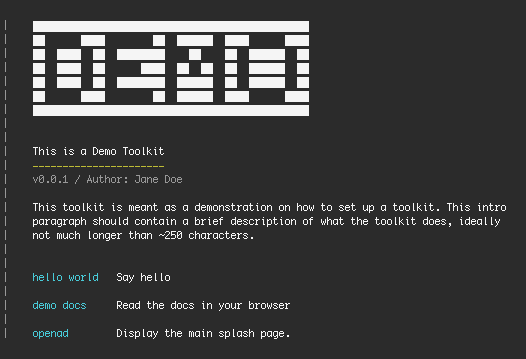
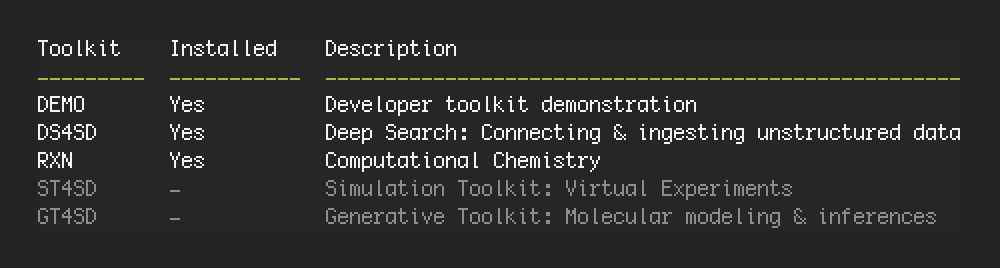

<!-- @future todo:
√ - Hide demo and readme from list of toolkits
√ - Update list of toolkits with DEMO toolkit included
- Make hello world with bunch of options
√ - Rename description.txt to llm_description.txt
√ - Make login.py not required
√ - Cleanout current toolkits to follow same basename conventions
√ - DS4SD -> create search/display folder
- @future We should have a command update toolkit
- @future archiving of a toolkit should happen on the moment of `remove toolkit` instead of at moment of `add toolkit`.
-->
> **WARNING:** This documentation page is still under construction. It is incomplete and may have incorrect information.

---

# Creating Your Own Toolkit <!-- omit from toc -->

Integrating your own workflows into OpenAD is relatively straightforward.

### Table of Contents <!-- omit from toc -->
- [Setup](#setup)
  - [metadata.json](#metadatajson)
  - [login.py](#loginpy)
- [Adding Commands](#adding-commands)
  - [1. Command File - fn\_hello\_world.json](#1-command-file---fn_hello_worldjson)
  - [2. Function file - fn\_hello\_world.py](#2-function-file---fn_hello_worldpy)
  - [3. Description file - fn\_hello\_world.txt](#3-description-file---fn_hello_worldtxt)
- [Publishing a Toolkit](#publishing-a-toolkit)
  - [description.txt](#descriptiontxt)
  - [oneline\_desc.txt](#oneline_desctxt)
  - [Submitting](#submitting)

<br><br>

## Setup

The toolkit architecture depends on a few basic files to work. You can copy the [DEMO](./DEMO) toolkit directory to hit the ground running.


1. [`metadata.json`](#metadatajson)
2. [`login.py`](#loginpy) (optional)

<br>

### metadata.json

This mandatory file is responsible for generating the toolkit's splash screen. This is displayed when the user enters the toolkit context by running `set context <toolkit_name>`.

    {
        "banner": "DEMO",
        "title": "This is a Demo Toolkit",
        "author": "Jane Doe",
        "version": "0.0.1",
        "intro": "This toolkit is meant as a demonstration on how to set up a toolkit. This intro paragraph should contain a brief description of what the toolkit does, ideally not much longer than ~250 characters.",
        "commands": {
            "hello world": "Say hello",
            "demo docs": "Read the docs in your browser"
        }
    }

The splash screen generated from the JSON file above looks like this:

<a href="readme/demo-splash.png" target="_blank"></a>

<br>

### login.py

Here you can expose your authentication API. If this file is present, is will be called whenever the user enters the toolkit context by running `set context <toolit_name>`. If this file is not present, authentication will be skipped.

The [`login.py`](./DEMO/login.py) template takes care of success and error handling and ensures a unified user experience across all tookits. Instructions are in the file. You may have to customize it a bit more if your authentication API doesn't follow jwt/host/email/api_key conventions.

<br><br>

## Adding Commands

Each command is contained in two (or three) files. Their filename structure should follow the pattern `fn_\<fn_name\>.<ext>`.

We'll document the "hello world" example from our demo toolkit.
1. [**The command file (JSON)**](#1-command-file---fn_hello_worldjson)<br>
Contains the command structure and help parameters.<br>
`fn_hello_world.json`
1. [**The function file (Python)**](#2-function-file---fn_hello_worldpy)<br>
Contains the command function to be executed.<br>
`fn_hello_world.py`
1. [**The description file (text)**](#3-description-file---fn_hello_worldtxt) (optional)<br>
May contain a more elaborate command description, when a field in the JSON command file is not enough.<br>
`fn_hello_world.txt`

Per function, these three files should be stored in the same directory. However the total of all your functions can be organized into a directory structure as desired. We will scan your entire toolkit directory tree and parse any command files we find.

<br>

### 1. Command File - fn_hello_world.json

This file is the "entry point". It describes the command to the language parser and contains the command documentation used for displaying help.

Multiple JSON command files may point to a single Python function file containing multiple methods. They are linked through the `library` parameter in the JSON command file.

Our example `fn_hello_world.json` file structure looks as follows:

    {
        "fplugin": "demo",
        "command": "hello world", 
        "subject": "hello world",
        "exec_type": "standard_statement",
        "exec_cmd": "hello world",
        "help": {
            "name": "hello world",
            "category": "General",
            "command": "hello world", // <-- See Command Notation
            "description": "Display \"Hello, world\"",
            "url": "https://helloworld.app/docs#hello-world"
        },
        "library": "fn_hello_world",
        "method": "print_hello_world",
        // Command clauses go here
    }

<details>
<summary><b>JSON Breakdown</b></summary>

-   `fplugin`<br>
    The name of your toolkit, the same as your tookit directory but written lowercase.
    <!-- @future rename this field to "tookit" -->
-   `command`<br>
    This is the command prefix. It is combined with the command clauses to contruct the command as it will be interpreted by the parser.
-   `subject`<br>
    This is a deprecated field and can be left blank. It will be removed in a future release.
    <!-- @future remove and test -->
-   `exec_type`<br>
    For now, this should always be set to "standard_statement". We plan to add more functionality here in the future.
    <!-- Meant for commands like `exec display_collection("foobar")` but currently no active examples -->
-   `exec_cmd`<br>
    For now, this can be left blank. This field will play a role in future functionality.
    <!-- Not currently used, was meant for storing meta information about the command... -->
-   `help`<br>
    Contains all we need to plug into the OpenAD help functionality.
    -   `name`<br>
        The name of this command. For simple commands, it will be the same as the command itself, for longer commands it can be more descriptive.
        <!-- Currentlt not used anywhere -->
    -   `category`<br>
        The category under which this command is organized. If you don't have different categories for your commands, you can set this to "General".
    -   `command`
        The structure of the command as it will be displayed in the list of commands, or when a user requests help about this particular command. See [Command Documentation](#command-documentation) below for guidance about notation.
    -   `description`<br>
        A description of what the command does. If your command description is going to be longer than one or two lines, we recommand to set this value to an empty string ("") and store the description in a separate text file. See [3. Description file - func\_hello\_world.txt](#3-description-file---fn_hello_worldtxt)
    -   `url`<br>
        A link to online documentation for this command.
-   `library`<br>
    The base name (no extension) of the Python function file that is being called. The Python function file needs to be in the same directory as the JSON command file.
-   `method`<br>
    The name of the method that is being called inside the Python function file.

</details>
<details>
<summary><b>Command Clauses</b></summary>

These are common built-in command patterns that represent certain behaviors. Together with the `command` parameter of your JSON file, they define the structure of your command.
-   `SAVE_AS`<br>
    This (always optional) clause is meant for functions that output data, and should cause the output of your command function to be saved to disk instead of being displayed.
    
    -   **JSON notation:** `"SAVE_AS": {}`
    -   **Function access:** `if "save_as" in inputs:`
    -   **Command notation:** `hello world [ save as '<filename.txt>' ]`

-   `ESTIMATE_ONLY`<br>
    This (always optional) clause is meant for functions that may take a long time to return results, and should cause your function to return an estimate of result count rather than the actual results.

    -   **JSON notation:** `"ESTIMATE_ONLY": {}`
    -   **Function access:** `if "estimate_only" in inputs:`
    -   **Command notation:** `hello world [ estimate only ]`
-   `RETURN_AS_DATA`<br>
    This (always optional) clause is meant for functions that return styled data, and should remove any styling from your data so it can be consumed by endpoints where the styling is not welcome.

    -   **JSON notation:** `"RETURN_AS_DATA": {}`
    -   **Function access:** `if "return_as_data" in inputs:`
    -   **Command notation:** `hello world [ return as data ]`
-   `SINGLE_PARM`<br>
    This clause denotes a single variable in the command.
    
    -   **JSON notation:** `"SINGLE_PARM": { "foo": "desc" }`<!-- @future desc should be renamed to quoted_str -->
    -   **Function access:** `if "foo" in inputs:`
    -   **Command notation:** `hello world '<foo>'`
-   `IN_CLAUSE`<br><!-- @future needs to be made uppercase + rename to MULTI_PARM, as it is the same as SINGLE_PARM but for handling multiple parameters -->
    To clause is used to inject one or more parameters in the middle of a command. It should be combined with the \<IN_CLAUSE\> tag inside the command field, eg. `hello <in_clause> world`

    -   **JSON notation:** `"in_clause": { "foo": "str", bar: "desc" },`<!-- @future desc should be renamed to quoted_str -->
    -   **Function access:** `if "foo" in inputs:`
    -   **Command notation:** `hello <foo> '<bar>' world`
-   `SHOW`<br>
    This (always optional) clause is meant for functions that may return different types or formats of data, and should be used to specify what kind of data to return.

    -   **JSON notation:** `"SHOW": ["foo", "bar"]`
    -   **Function access:**
        ```
        if "show_data" in inputs:
            for option in inputs["show_data"]:
                if option == "foo":
        ```     
    -   **Command notation:** `hello world show (foo | bar)`
-   `USING`<br>
    This clause is meant to pass a number of custom, optional variables to your function.

    -   **JSON notation:**
        ```
        "USING": {
            "foo": "str",
            "bar": "desc"
            "page_size": "int"
        }
        ```
        <!-- @future desc should be renamed to quoted_str -->
    -   **Function access:**
        ```
        if "foo" in inputs:
            foo = inputs["page_size"][val]
        ```
    -   **Command notation:** `hello world using (foo=<str> bar='<str>' page_size=<int>)`
-   `FROM`<br><!-- @future needs to be made uppercase -->
     This clause is meant for functions that allow for different input types, where it indicates the provided input type. Only "dataframe", "file" and "list" are supported as input types.

    -   **JSON notation:** `"FROM": ["dataframe", "file", "list"]`
    -   **Function access:**
        ```
        if isinstance(inputs["from_source"], dict) and inputs["from_source"]["from_list"] is not None:
            from_list = inputs["from_source"]["from_list"]
        elif "from_list" in inputs["from_source"][0]:
            from_list = inputs["from_source"][0]["from_list"]
        elif "from_dataframe" in inputs:
            dataframe = inputs["from_dataframe"]
        elif "from_file" in inputs:
            from_file = inputs["from_file"]
        ```
        <!-- @future simplify this -->
    -   **Command notation:** `hello world from dataframe <dataframe_name> | file '<filename.csv>' | list ['<string>','<string>']`
-   `USE_SAVED`<br><!-- @future needs to be made uppercase -->
    This clause is meant for functions that use cacheing, where it indicates that a cached result can be used instead of re-running the function.

    -   **JSON notation:** `"USE_SAVED": "True"` <!-- @future instead of True this should be {} to be consistent with other clauses like USE_SAVED (or vice versa) -->
    -   **Function access:** `if "use_saved" in inputs:`
    -   **Command notation:** `hello world [ use_saved ]`<!-- @future shouldn't use underscore to be consistent with `save as` etc -->
<!-- @future this is currently not used, can be added to documentation whenever we do.
-   `ASYNC`<br>
    TBD for later

    -   **JSON notation:** `"ASYNC": "both"` `"ASYNC": "only"`
    -   **Function access:** `TBD (do_async/async)`
    -   **Command notation:** `TBD`
-->

</details>

<details>
<summary><b>Command Notation</b></summary>

-   Optional clauses should be encapsulated in square brackets padded with a space.

        hello world [ repeat 2 ]
    
-   Variable names should be displayed with angle brackets and underscores instead of spaces. When a variable is to be quoted, make sure to include the quotation marks in the command.

        hello [ <audience_name> ]
        hello [ '<first_name>' ]

-   When describing different options for a clause, list them separated by a pipe. For long commands, it may be unclear which word is part of the main command or the clause options. To avoid confusion, make sure to add examples to your command description that will resolve any confusion.

        hello world pink | red | green

-   When describing a filename, add the extension(s) in the variable name, as such:

        hello world [ save as <filename.txt> ]
        hello world [ save as <csv_or_sdf_filename> ]

- When describing lists, make sure to notate them without spaces between the square brackets, to avoid confusion with optional clauses. Also make it clear what is supposed to go in the list. Use ellipsis to indicate whether the length of the list can be infinite.

        hello ['<first_name>','<first_name>',...]

</details>

<br>

### 2. Function file - fn_hello_world.py

This file contains your command function which get executes when running the command. It gets passed two parameters:
- `inputs` A dictionary containing all information relating to the command that was run.
- `cmd_pointer` An instance of the [RUNCMD class](../app/main.py), which is a subclass of the [`Cmd`](https://docs.python.org/3/library/cmd.html) library class.

Our example `fn_hello_world.py` file structure looks as follows:

    def hello_world(inputs: dict, cmd_pointer):
        print('hello, world')
        # to do: print inputs and cmd_pointer content

It's output:

    hello, world

    inputs:
    - ...

    cmd_pointer:
    - ...

<br>

### 3. Description file - fn_hello_world.txt

Only one description text file can exist per JSON command file. When "help.description" in the JSON command file is set to an empty string (""), we'll automatically look for the description text file, which is linked by having the same base filename.

The description text is parsed for different outputs (CLI, Jupyter, HTML, API) and is required to follow a specific OpenAD styling syntax, the documentation for which you can find [here](#).

Our [`fn_hello_world.txt`](./DEMO/commands/fn_hello_world.txt) example covers the most important aspects and follows a template consistent with other toolkits. We highly recommend to stick to this template as much as possible.

You can preview its content by running `set context demo` followed by `? hello world` in the CLI, or the same commands prepended by `%openad` in a Jupyter Notebook.

<br><br>

## Publishing a Toolkit

If you think your toolkit can provide value for the OpenAD community, we encourage you to submit it to our official toolkit library. By doing so, it will be made available for all OpenAD users to install, simply by running `add toolkit <toolkit_name>`, and it will be displayed in the list of toolkits when you run `list all toolkits`.

Your toolkit can also be made available through other channels, so people can download it elsewhere and install it by running `add toolkit <toolkit_name> from <toolkit_path>`.

For either scenario to work smoothly, two more files are required:
1. [`description.txt`](descriptiontxt)
2. [`oneline_desc.txt`](oneline_desctxt)

<br>

### description.txt

The `description.txt` file is used to train the LLM with the toolkit functionality. This way our AI assistant can help OpenAD users figuring out how to use your toolkit. The text file should contain a detailed, unambiguous description of how your toolkit works and what it is meant to achieve. You can look at the other toolkits for inspiration.

At the bottom of your file, on a separate line, you should include the following line, verbatim:

    The following commands are available for this toolkit:

Then you should run the script below, which gathers all your toolkit commands and lists them at the bottom of the description file. The script will look for the line described above and replace everything after with the updated commands. If this exact line is not present, the script will abort and throw an error.

    python openad/user_toolkits/<toolkit_name>/description_update.py

<br>

### oneline_desc.txt

This file contains a very brief description of the toolkit, using only 4-5 words. This will be displayed when listing available or installed toolkits.

<a href="readme/toolkit-list.png" target="_blank"></a>

<br>

### Submitting

Once your toolkit adheres to the specifications described on this page, [get in touch](https://acceleratedscience.github.io/openad-docs/about.html) so we can review and consider it for the list of publicly available OpenAD toolkits.